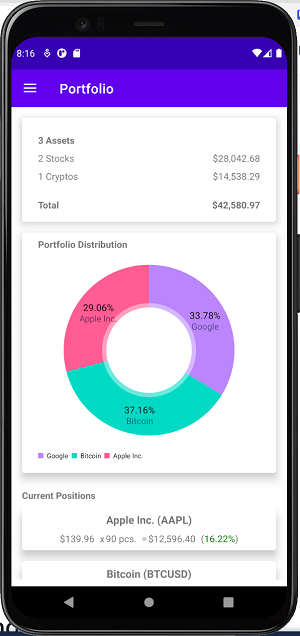
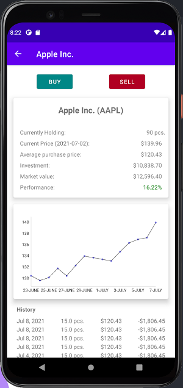
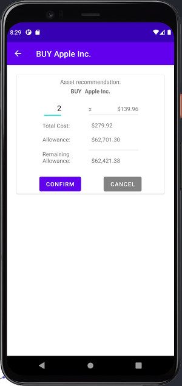
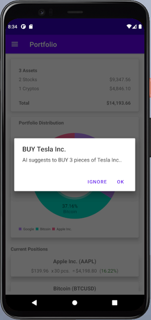
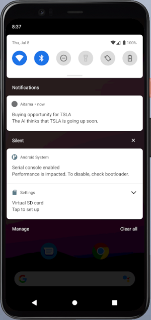
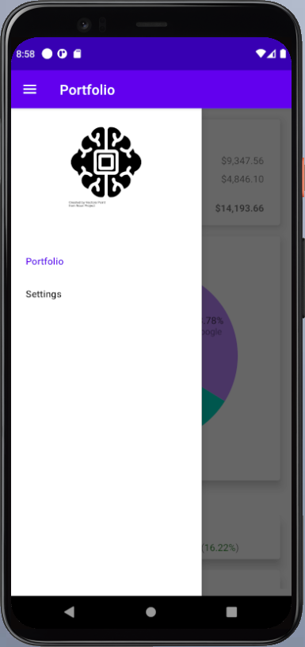
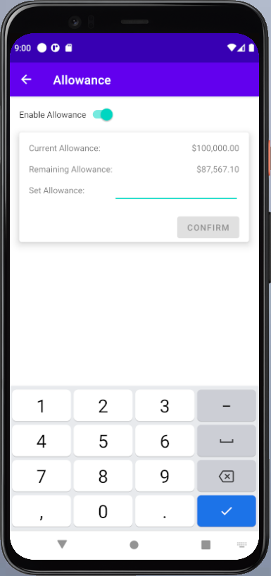

# AITAMA

AITAMA is a the Mobile APP (MA) for the Artificial Intelligence Trading Assistant (AITA). 

## Main features

1. Portfolio Overview
2. Portfolio Performance
3. React to trading opportunities offered by AITA
4. Manage allowance

## Structure of the App

The application consists of the following views:
 - [Home View](#Home)
 - [Asset Detail View](#Asset-Detail-View)
 - [Transaction View](#Transaction-View)
 - [Notification](#Notification)
 - [Manage Allowance](#Manage-Allowance)
### Home

On startup, the App displays the current portfolio.

#### Asset distribution

The first Element shows the distribution of your Asset types, 
which are differenciated between Stocks and Cryptocurrencies.
Aditionally a total overview of the current portfolio can be seen.

#### Portfolio distribution

This Elements shows a distribution of all open positions in a piechart.

#### Current positions

The last element gives an overview about the current active positions.

#### Screenshot

### Asset Detail View

Below the Pie chart a list of current positions can be found. 
Click it to navigate to the Detail view of your position.

#### Buy/Sell

The first Element shows two buttons which respecivly allow to buy or sell more of the current asset. Clicking on one of those buttons navigates the user to a view which allows to configure fine tune the option.

#### Price Chart

The second Element shows a two week Price chart of the choosen Asset.

#### History

Lastly, a history of all positions is displayed.

#### Screenshot

### Transaction View

The transaction view displays information about the stock it self as well as the remaining allowance.  
This view can be reached by either navigating to it manually through a detail view or by accepting a suggestion from AITA.

#### Screenshot

### Notification

When AITA finds a good opportunity to buy or sell, it will send a push notification to the user.  
When the App is open, the user will see it as a dialog in the app and can choose to accept or ignore it.  
When the app is in the background or closed, a push notification in the notification drawer will be added.

#### Screenshot
##### Open

##### Background/Closed

### Manage Allowance

If the users chooses to, 
an allowance can be activated to restrict the amount of available money.  
So when the user trys to buy something or accepts and suggestion by AITA, 
the user cannot spend more than the set allowance.
When the user makes profit and sells some of his assets, the allowance increased again.

To reach the allowance settings, the user has to navigate by clicking the burger button
on the top left to open the menu. Then click the Settings option to navigate to the see the allowance options.

#### Screenshots

##### Menu 

##### Allowance settings

